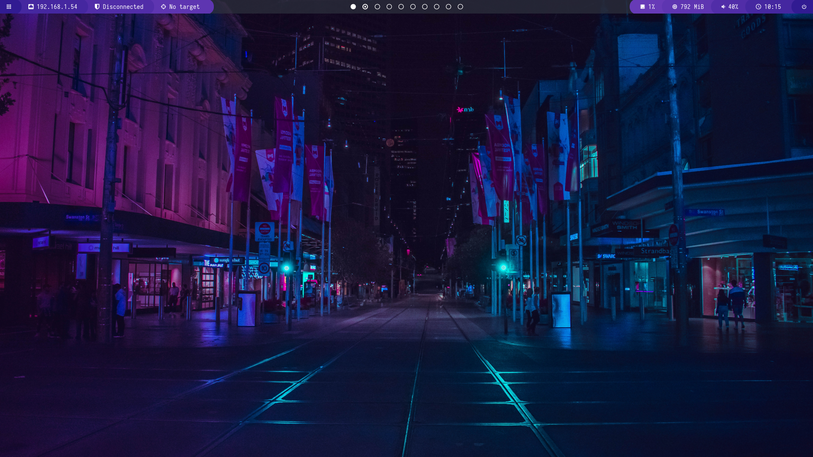
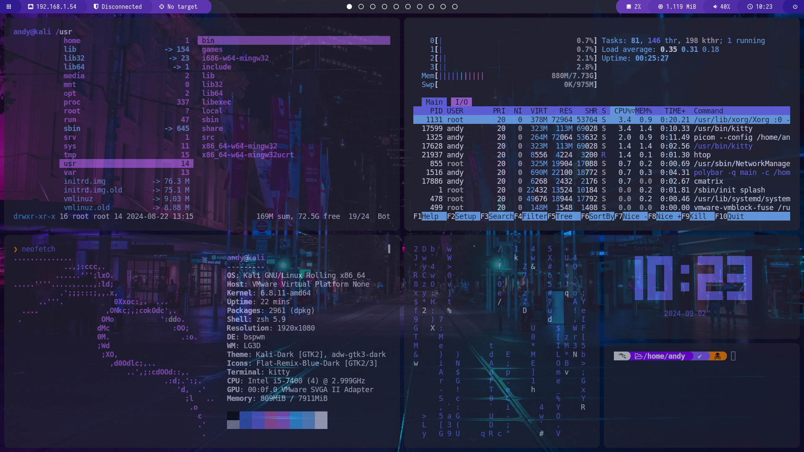
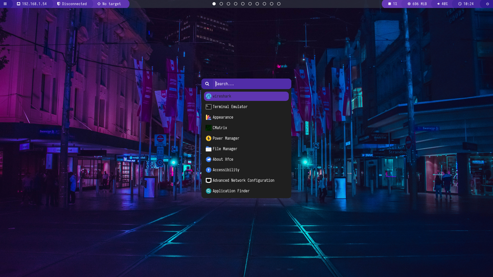
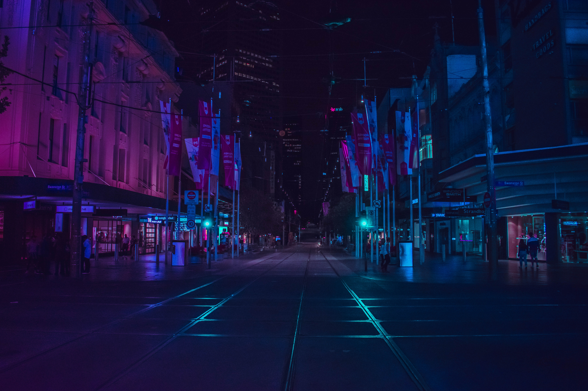
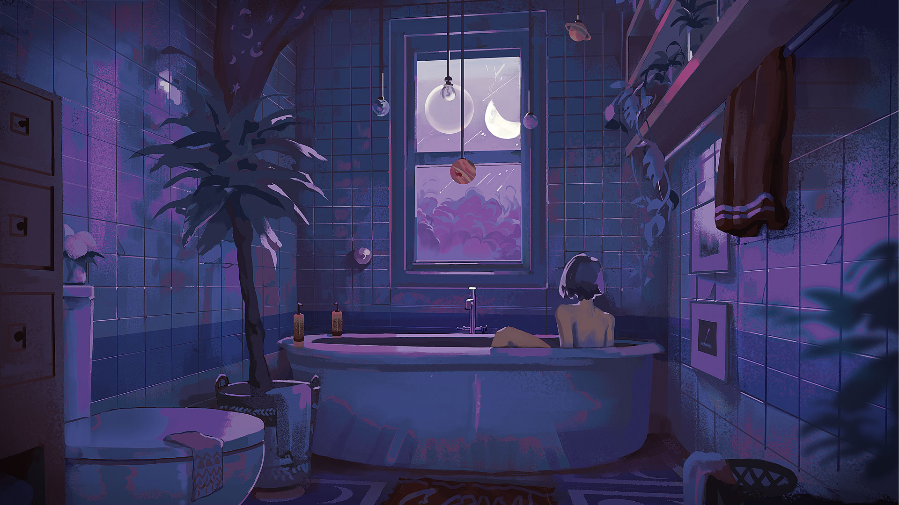

```

_____ __      _________            ______                                      
__  // /____________  /____  __    ___  /___________________      ________ ___ 
_  // /__  __ \  __  /__  / / /    __  __ \_  ___/__  __ \_ | /| / /_  __ `__ \
/__  __/  / / / /_/ / _  /_/ /     _  /_/ /(__  )__  /_/ /_ |/ |/ /_  / / / / /
  /_/  /_/ /_/\__,_/  _\__, /      /_.___//____/ _  .___/____/|__/ /_/ /_/ /_/ 
                        /____/                     /_/
                                                                by: 4ndymcfly                           

```

> [!NOTE]
> This is a Bash script that automates the setup of a professional hacking environment for Kali Linux using the tiled window manager [bspwm](https://github.com/baskerville/bspwm) and is forked from [r1v3sc](https://github.com/r1vs3c/auto-bspwm) repository.

## Installation
1. Install available updates.

```shell
sudo apt update
sudo apt upgrade -y
```

2. Clone the repository and navigate to it.

```shell
git clone https://github.com/4ndymcfly/4ndy-bspwm
cd 4ndy-bspwm
```

3. Execute the script.

```shell
./setup.sh
```

4. After the script has finished, you will be prompted to restart the system. Once you have rebooted, select `bspwm` as the window manager and then log in.

## Overview of the environment (some changes in polybar)

<p align="center">
  
</p>

<br>

<p align="center">
  
</p>

<br>

<p align="center">
  
</p>

## Keyboard shortcuts (added some shortcuts)

- <kbd>Windows</kbd> + <kbd>Enter</kbd>: Open a terminal emulator window (kitty).
- <kbd>Windows</kbd> + <kbd>W</kbd>: Close the current window.
- <kbd>Windows</kbd> + <kbd>Alt</kbd> + <kbd>R</kbd>: Restart the bspwm configuration.
- <kbd>Windows</kbd> + <kbd>Alt</kbd> + <kbd>Q</kbd>: Log out.
- <kbd>Windows</kbd> + <kbd>(⬆⬅⬇➡)</kbd>: Navigate through windows in the current workspace.
- <kbd>Windows</kbd> + <kbd>D</kbd>: Open Rofi. Press <kbd>Esc</kbd> to exit.
- <kbd>Windows</kbd> + <kbd>(1,2,3,4,5,6,7,8,9,0)</kbd>: Switch to the respective workspace.
- <kbd>Windows</kbd> + <kbd>T</kbd>: Change the current window to tile mode.
- <kbd>Windows</kbd> + <kbd>M</kbd>: Toggle the current window to "full" mode (doesn't occupy the polybar). Press the same keys to return to tile mode.
- <kbd>Windows</kbd> + <kbd>F</kbd>: Change the current window to fullscreen mode (occupies the entire screen, including the polybar).
- <kbd>Windows</kbd> + <kbd>S</kbd>: Change the current window to floating mode.
- <kbd>Windows</kbd> + <kbd>Shift</kbd> + <kbd>(1,2,3,4,5,6,7,8,9,0)</kbd>: Move the current window to another workspace.
- <kbd>Windows</kbd> + <kbd>Alt</kbd> + <kbd>(⬆⬅⬇➡)</kbd>: Resize the current window (only works if it's in floating mode).
- <kbd>Windows</kbd> + <kbd>Ctrl</kbd> + <kbd>(⬆⬅⬆➡)</kbd>: Change the position of the current window (only works if it's in floating mode).
- <kbd>Windows</kbd> + <kbd>Shift</kbd> + <kbd>F</kbd>: Open Firefox on 3rd workspace.
- <kbd>Windows</kbd> + <kbd>Shift</kbd> + <kbd>B</kbd>: Open Burpsuite on 9th workspace.
- <kbd>Ctrl</kbd> + <kbd>Alt</kbd> + <kbd>L</kbd>: Lock the screen.
- <kbd>Ctrl</kbd> + <kbd>Shift</kbd> + <kbd>⬆⬇</kbd>: Increase/decrease volume.
- <kbd>Ctrl</kbd> + <kbd>Shift</kbd> + <kbd>M</kbd>: Mute/unmute volume.
- <kbd>Windows</kbd> + <kbd>Ctrl</kbd> + <kbd>Alt</kbd> + <kbd>(⬆⬅⬇➡)</kbd>: Show a preselection and then open a window (kitty, Firefox, File manager, etc.). 
   - <kbd>Windows</kbd> + <kbd>Ctrl</kbd> + <kbd>Alt</kbd> + <kbd>Space</kbd>: Undo the preselection.
- <kbd>Ctrl</kbd> + <kbd>Shift</kbd> + <kbd>Enter</kbd>: Open a sub-window in the current window.
- <kbd>Ctrl</kbd> + <kbd>Shift</kbd> + <kbd>Z</kbd>: Zoom in on the current sub-window.
- <kbd>Ctrl</kbd> + <kbd>(⬆⬅⬇➡)</kbd>: Navigate between sub-windows in the current window.
- <kbd>Shift</kbd> + <kbd>(⬆⬅⬇➡)</kbd>: Resize the sub-windows.
- <kbd>Ctrl</kbd> + <kbd>Shift</kbd> + <kbd>L</kbd>: Toggle the arrangement of sub-windows.
- <kbd>Ctrl</kbd> + <kbd>Shift</kbd> + <kbd>W</kbd>: Close the current sub-window or tab.
- <kbd>Ctrl</kbd> + <kbd>Shift</kbd> + <kbd>T</kbd>: Open a tab in the current window.
- <kbd>Ctrl</kbd> + <kbd>Shift</kbd> + <kbd>Alt</kbd> + <kbd>T</kbd>: Rename the title of the current tab.
- <kbd>Ctrl</kbd> + <kbd>Shift</kbd> + <kbd>(⬅➡)</kbd>: Navigate between current tabs.
- <kbd>Shift</kbd> + <kbd>Alt</kbd> + <kbd>(⬆⬇)</kbd>: Scroll to the beginning or end of the shell history buffer.
- <kbd>Shift</kbd> + <kbd>Alt</kbd> + <kbd>(⬅➡)</kbd>: Scroll one page up or down of the shell history buffer.
- <kbd>Ctrl</kbd> + <kbd>Shift</kbd> + <kbd>C</kbd>: Copy to the clipboard.
- <kbd>Ctrl</kbd> + <kbd>Shift</kbd> + <kbd>V</kbd>: Paste from the clipboard.
- <kbd>F1</kbd>: Copy to buffer A.
- <kbd>F2</kbd>: Paste from buffer A.
- <kbd>F3</kbd>: Copy to buffer B.
- <kbd>F4</kbd>: Paste from buffer B.

## Software
This configuration uses the following software:
- **WM**: [bspwm](https://github.com/baskerville/bspwm)
- **Hotkey**: [sxhkd](https://github.com/baskerville/sxhkd)
- **Locker**: [i3lock-fancy](https://github.com/meskarune/i3lock-fancy)
- **Shell**: [zsh](https://www.zsh.org/)
- **Shell Theme**: [powerlevel10k](https://github.com/romkatv/powerlevel10k)
- **Shell configuration manager**: [ohmyzsh](https://github.com/ohmyzsh/ohmyzsh)
- **Bars**: [polybar](https://github.com/polybar/polybar)
- **Bars Theme**: [polybar-themes](https://github.com/adi1090x/polybar-themes)
- **Compositor**: [picom](https://github.com/yshui/picom)
- **File Manager**: [thunar](https://docs.xfce.org/xfce/thunar/start)
- **Fonts**: [iosevka](https://github.com/ryanoasis/nerd-fonts/tree/master/patched-fonts/Iosevka) and [hack](https://github.com/ryanoasis/nerd-fonts/tree/master/patched-fonts/Hack)
- **Application Launcher**: [rofi](https://github.com/davatorium/rofi)
- **Browsers**: [firefox](https://www.mozilla.org/en-US/firefox/new/)
- **Terminals**: [kitty](https://sw.kovidgoyal.net/kitty/) and [qterminal](https://github.com/lxqt/qterminal)
- **Static Wallpaper**: [feh](https://github.com/derf/feh)
- **Screenshot**: [flameshot](https://flameshot.org/)

## Software added
In addition, this configuration includes the following software:
- **The next gen ls command**: [lsd (LSDeluxe)](https://github.com/lsd-rs/lsd) (Updated version that resolves visual issues)
- **Collection of multiple lists: [seclists](https://github.com/danielmiessler/SecLists)
- **Container application**: [Docker](https://www.docker.com/)
- **hyperextensible Vim-based text editor**: [Neovim](https://github.com/neovim/neovim)
- **Isolated Package Manager**: [pipx](https://github.com/pypa/pipx)
- **Common User Passwords Profiler**: [cupp](https://github.com/Mebus/cupp)
- **JSON Processor**: [jq](https://github.com/jqlang/jq)
- **Resource monitor**: [btop](https://github.com/aristocratos/btop)
- **Vulnerability Scanner**: [nuclei](https://github.com/projectdiscovery/nuclei)
- **Tunneling tool**: [ligolo-ng](https://github.com/nicocha30/ligolo-ng) (chisel and socat alternative)
- **Fuzzing tool**: [gobuster](https://github.com/OJ/gobuster)
- **Web path scanner**: [dirsearch](https://github.com/maurosoria/dirsearch)
- **And more ...**

## Alias and functions
> [!TIP]
> A wide range of aliases and functions have been added to streamline your workflow. Refer to the `.zshrc` file for more details.

## New walpapers
<p align="center">
  
  
  
  
</p><p align="center">
  
  
  
  
</p><p align="center">
  
  
  
  
</p><p align="center">
  
  
  
  
</p><p align="center">
  
  
   
  
</p><p align="center">
  
  
  
  

## Credits
- Special thanks to [r1vs3c](https://github.com/r1vs3c/auto-bspwm) for creating and sharing this script.
